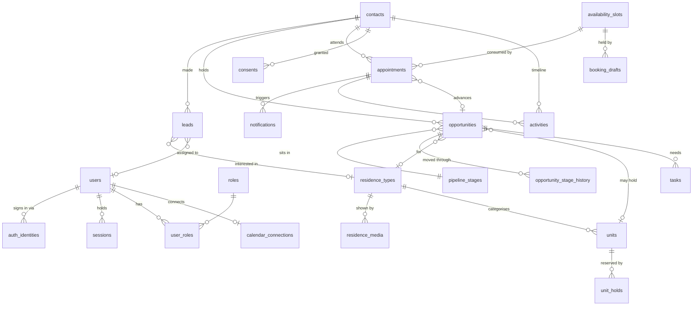

# Database

PostgreSQL 17 · Prisma 6 · 26 tables. Schema: [`backend/prisma/schema.prisma`](../backend/prisma/schema.prisma).

## Entity relationships



## The two decisions that shape everything

### Contact ≠ Lead

A **Contact** is a deduplicated person. A **Lead** is a single enquiry event.

```
Ahmed Khan enquires 4 times over 6 months
  → 1 contact
  → 4 leads      (which residence, which campaign, when — the sales signal)
  → 1–2 opportunities (one per residence type he is seriously considering)
```

Deduplicating leads would destroy exactly the history an agent needs. Deduplicating
contacts is what stops the database filling with four copies of the same person.

`contacts.normalized_email` and `contacts.normalized_phone` are both `UNIQUE`.
PostgreSQL permits many NULLs in a unique index, so a contact known only by phone does
not collide with every other email-less contact.

### Opportunity is scoped per residence type

Someone weighing Sonder Class against a Duplex Penthouse has two genuinely different
purchase intentions, with different values and different probabilities. Collapsing
them into one row would make the pipeline lie about both.

Only *open* opportunities are reused — a buyer returning a year after a lost deal
starts a fresh one, so the funnel does not resurrect closed work.

## Constraints Prisma cannot express

Added by hand in the migration. These are not belt-and-braces; they are the last line
of defence for invariants the business depends on. Application code can be refactored
into a bug; a `CHECK` constraint cannot be talked out of rejecting a bad row.

| Constraint | Prevents |
|---|---|
| `availability_slots_booked_count_within_capacity` | Overselling a slot, whatever service code believes |
| `availability_slots_capacity_positive` | A zero/negative-capacity slot that can never be booked |
| `availability_slots_ends_after_starts`, `appointments_ends_after_starts` | Inverted time ranges |
| `opportunities_probability_range` | A 4200% probability corrupting weighted-pipeline figures |
| `opportunities_estimated_value_non_negative`, `units_asking_price_non_negative` | Negative money |
| `pipeline_stages_single_default` (partial unique) | Two stages both claiming to be where new opportunities land |
| `contacts_has_identifier` | A contact with no email and no phone — undedupable and uncontactable |
| `users_email_lower_key` (functional unique) | `Sara@fwce.info` and `sara@fwce.info` becoming two accounts |

Three partial indexes keep the hot CRM paths small by excluding rows that become the
majority over time: `appointments_upcoming_idx`, `tasks_open_due_idx`,
`leads_unassigned_idx`.

## Money and time

- Money is `Decimal(14,2)`, never `Float`. Prices stay `NULL` until Foakh publishes an
  authoritative price list — an invented figure would corrupt every pipeline report.
- Timestamps are `timestamptz`, stored as UTC instants. The Foakh-side zone lives in
  `appointments.timezone` and the visitor's in `visitor_timezone`, so a confirmation
  can render both. A slot shown as "10:00 PKT" stays 10:00 PKT wherever the server runs.

## Idempotency and dedupe keys

Several tables carry an explicit key so that retrying an operation converges instead of
duplicating:

| Table | Key | Purpose |
|---|---|---|
| `idempotency_keys` | `(scope, key)` | Replays a booking confirmation for a repeated POST |
| `availability_slots` | `dedupe_key` | Re-running the seed cannot create two rows for one real slot |
| `tasks` | `automation_key` | A retried workflow updates rather than piling up five "Call this lead" tasks |
| `notifications` | `dedupe_key` | A redelivered event does not send a second confirmation |
| `integration_events` | `(provider, external_id)` | Provider redelivery is a no-op |

`availability_slots.dedupe_key` is an explicit string (`TYPE:ISO:host|POOL`) rather
than a composite unique on `(host_user_id, type, starts_at)`, because a NULL host would
silently permit duplicates under a composite unique.

## Append-only ledgers

Three tables are written and never edited, because their value is that they record what
was true at the time:

- `consents` — a revocation is a new row. "What did they agree to on the day?" stays
  answerable.
- `opportunity_stage_history` — with `duration_seconds` precomputed, so funnel queries
  stay flat.
- `audit_logs` — snapshots are **redacted** before storage. An audit log answers "who
  changed what, when"; it does not need the customer's phone number, and storing it
  would create a second copy of the contact database with different access controls.

## Seed data

`pnpm seed` is idempotent — every write is an upsert keyed on a natural identifier, and
nothing is ever deleted. Re-seeding a live environment must not remove a residence a
marketer edited or a slot a visitor has already booked.

It creates: 5 roles · the bootstrap admin (only if a password is configured) ·
12 pipeline stages · 4 residence types with 20 media rows · 168 mock units
(160 apartments + 8 penthouses across Umer and Abdullah) · ~600 availability slots for
the next 45 days · assignment settings.

Every unit is `status = MOCK`, `inventory_mode = MOCK`, `is_published = false`, with no
price. They exist so the CRM has something to reason about, **not** so the website can
claim stock.

## Migrations

Expand/contract, always:

```
Release A   add the nullable new column
Release B   write both old and new
   ↓        backfill
Release C   read from new
Release D   drop old
```

Never ship a destructive schema change and an incompatible application deploy together
— there is no moment during a rolling deploy when both versions are not running.

CI runs `prisma migrate diff --from-migrations --to-schema-datamodel --exit-code`, which
fails the build if `schema.prisma` has drifted from `prisma/migrations`. Without that
check, a schema edit can ship with no migration and only fail on the production deploy.

## Prisma version note

Pinned to **6.19.3** rather than 7.x. Prisma 7 replaces `prisma-client-js` with a
generator requiring an explicit output path and a driver adapter, which introduces ESM
friction with Nest's CommonJS build for no Phase-One benefit. The upgrade is a
contained piece of work: swap the generator block, add `@prisma/adapter-pg`, and move
`package.json#prisma` to `prisma.config.ts`.
